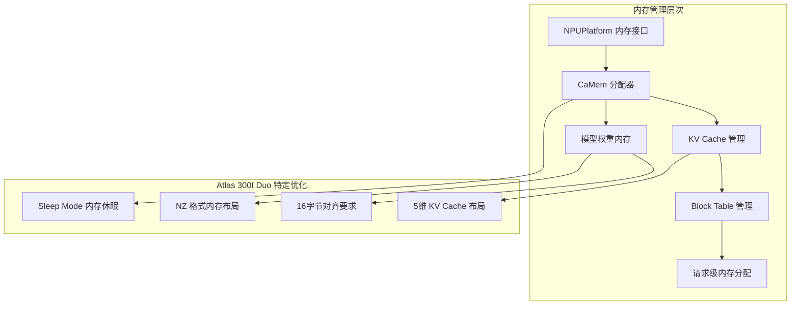

# 内存管理和 KV Cache 流程

## 概述

本文档深入分析 vLLM Ascend 在 Atlas 300I Duo 平台上的内存管理机制，重点关注 KV Cache 的特殊布局和 CaMem 分配器的实现。

## 内存管理架构图



## 详细流程分析

### 1. 内存管理平台抽象

#### 1.1 NPUPlatform 内存接口
**文件**: `platform.py:111-119`

```python
@classmethod
def mem_get_info(cls) -> Tuple[int, int]:
    return torch.npu.mem_get_info()

@classmethod
def clear_npu_memory(cls):
    gc.collect()
    torch.npu.empty_cache()
    torch.npu.reset_peak_memory_stats()
```

**功能**:
- **内存查询**: 获取设备内存使用情况
- **内存清理**: 垃圾回收和缓存清空
- **统计重置**: 重置峰值内存统计

#### 1.2 内存可用性检测
**文件**: `worker/worker_v1.py:179-199`

```python
def determine_available_memory(self) -> int:
    # 清理内存并获取基准
    NPUPlatform.clear_npu_memory()
    _, total_npu_memory = NPUPlatform.mem_get_info()

    # 执行模型预热以评估内存使用
    self.model_runner.profile_run()

    # 计算可分配的 cache 块数量
    free_npu_memory, _ = NPUPlatform.mem_get_info()
    assert self.init_npu_memory > free_npu_memory

    # 计算 KV Cache 可用内存
    available_kv_cache_memory = (
        free_npu_memory -
        self.model_config.block_size * self.cache_config.num_cpu_blocks
    )
    return available_kv_cache_memory
```

### 2. CaMem 分配器 (Sleep Mode)

#### 2.1 分配器架构
**文件**: `device_allocator/camem.py`

```python
class CaMemAllocator:
    """CANN-mem-based pytorch pluggable allocator to implement sleep mode."""

    def __init__(self):
        self._usage = 0
        self._allocated_tensors = {}

    @classmethod
    def get_instance(cls):
        if not hasattr(cls, '_instance'):
            cls._instance = cls()
        return cls._instance
```

#### 2.2 内存使用追踪
**功能特性**:
- **使用量统计**: 追踪已分配内存总量
- **张量管理**: 维护已分配张量的索引
- **生命周期管理**: 支持内存休眠和恢复

#### 2.3 上下文管理器
```python
@contextmanager
def forward_use_cann_mem(self):
    """Forward use CANN memory context manager."""
    try:
        # 启用 CANN 内存管理
        self._enable_cann_mem_management()
        yield
    finally:
        # 恢复默认内存管理
        self._restore_default_mem_management()
```

### 3. KV Cache 内存布局

#### 3.1 Atlas 300I Duo 特殊布局
**文件**: `attention/attention_v1.py`

```python
def get_kv_cache_shape(
    num_blocks: int,
    block_size: int,
    num_kv_heads: int,
    head_size: int,
) -> Tuple[int, ...]:
    if is_310p():
        # 310P 使用 5 维布局: (2, num_blocks, head_groups, block_size, group_size)
        return (2, num_blocks, num_kv_heads * head_size // 16, block_size, 16)
    else:
        # 其他平台使用 4 维布局: (2, num_blocks, block_size, hidden_size)
        return (2, num_blocks, block_size, num_kv_heads * head_size)
```

**布局对比**:
- **标准布局**: `[2, num_blocks, block_size, hidden_size]`
- **310P 布局**: `[2, num_blocks, head_groups, block_size, 16]`
- **优势**: 更好的内存访问局部性和对齐

#### 3.2 内存分配策略
```python
def allocate_kv_cache(self, num_blocks: int):
    kv_cache_shape = self.get_kv_cache_shape(
        num_blocks, self.block_size, self.num_kv_heads, self.head_size
    )

    # 分配 Key 和 Value cache
    kv_cache = torch.empty(
        kv_cache_shape,
        dtype=self.kv_cache_dtype,
        device=self.device
    )

    if is_310p():
        # 310P 需要额外的对齐处理
        kv_cache = aligned_16(kv_cache)

    return kv_cache
```

#### 3.3 Block Table 管理
**文件**: `worker/block_table.py`

```python
class BlockTable:
    """管理请求的物理块分配"""

    def __init__(self, block_size: int, num_blocks: int):
        self.block_size = block_size
        self.num_blocks = num_blocks
        self.free_blocks = list(range(num_blocks))
        self.allocated_blocks = {}

    def allocate_blocks(self, seq_id: str, num_blocks: int) -> List[int]:
        """为序列分配物理块"""
        if len(self.free_blocks) < num_blocks:
            raise OutOfMemoryError("Insufficient KV cache blocks")

        blocks = self.free_blocks[:num_blocks]
        self.free_blocks = self.free_blocks[num_blocks:]
        self.allocated_blocks[seq_id] = blocks
        return blocks
```

### 4. 内存对齐与优化

#### 4.1 16字节对齐函数
**文件**: `utils.py`

```python
def aligned_16(tensor: torch.Tensor):
    """Atlas 300I Duo 的张量对齐函数"""

    # 获取当前第0维大小
    current_size = tensor.size(0)

    # 计算对齐后的大小
    aligned_size = (current_size + 15) // 16 * 16

    if aligned_size == current_size:
        return tensor

    # 创建对齐的张量
    aligned_shape = list(tensor.shape)
    aligned_shape[0] = aligned_size

    aligned_tensor = torch.zeros(aligned_shape,
                                dtype=tensor.dtype,
                                device=tensor.device)
    aligned_tensor[:current_size] = tensor

    return aligned_tensor
```

#### 4.2 格式转换优化
```python
def nd_to_nz_2d(in_tensor: torch.Tensor) -> torch.Tensor:
    """ND 格式到 NZ 格式的转换 (Atlas 300I Duo)"""

    # 添加填充使其能被16整除
    aux_dims = [1, 0, 0, 16]
    padded_tensor = _custom_pad(in_tensor, aux_dims)

    # 重塑为特定形状
    batch_size, seq_len = padded_tensor.shape
    target_shape = [1, batch_size, seq_len // 16, 16]
    reshaped_tensor = _custom_reshape(padded_tensor, target_shape)

    # 转置维度
    transposed_tensor = _custom_transpose(reshaped_tensor, 1, 2)

    return transposed_tensor
```

### 5. 请求级内存管理

#### 5.1 输入批次内存
**文件**: `worker/npu_input_batch.py`

```python
class InputBatch:
    """管理输入批次的内存分配"""

    def __init__(self, max_num_reqs: int, max_num_tokens: int, device):
        self.max_num_reqs = max_num_reqs
        self.max_num_tokens = max_num_tokens
        self.device = device

        # 分配固定大小的张量池
        self._allocate_tensor_pools()

    def _allocate_tensor_pools(self):
        """预分配张量池以避免运行时分配"""
        self.token_ids = torch.zeros(
            (self.max_num_reqs, self.max_tokens_per_req),
            dtype=torch.int32, device=self.device
        )

        self.positions = torch.zeros(
            self.max_num_tokens,
            dtype=torch.int64, device=self.device
        )

        # Atlas 300I Duo 需要对齐
        if is_310p():
            self.token_ids = aligned_16(self.token_ids)
            self.positions = aligned_16(self.positions)
```

#### 5.2 动态内存调整
```python
def adjust_batch_size(self, new_batch_size: int):
    """根据实际使用情况调整批次大小"""
    if new_batch_size > self.max_num_reqs:
        # 需要扩展内存
        self._expand_tensor_pools(new_batch_size)
    elif new_batch_size < self.max_num_reqs // 2:
        # 可以收缩内存以节省空间
        self._shrink_tensor_pools(new_batch_size)
```

### 6. Sleep Mode 内存管理

#### 6.1 内存休眠机制
**文件**: `worker/worker_v1.py:127-157`

```python
def save_sleep_level_2_state(self) -> None:
    """保存 Level 2 休眠状态"""
    if not self.vllm_config.model_config.enable_sleep_mode:
        return

    # 保存模型缓冲区
    model = self.model_runner.model
    for name, buffer in model.named_buffers():
        if buffer.requires_grad:
            continue
        # 将缓冲区复制到 CPU
        self._sleep_saved_buffers[name] = buffer.cpu()

def restore_sleep_level_2_state(self) -> None:
    """恢复 Level 2 休眠状态"""
    if len(self._sleep_saved_buffers):
        model = self.model_runner.model
        for name, buffer in model.named_buffers():
            if name in self._sleep_saved_buffers:
                # 从 CPU 恢复到设备
                buffer.data.copy_(self._sleep_saved_buffers[name].data)
        self._sleep_saved_buffers = {}
```

#### 6.2 内存状态监控
```python
def monitor_memory_usage(self):
    """监控内存使用情况"""
    if self.vllm_config.model_config.enable_sleep_mode:
        allocator = CaMemAllocator.get_instance()
        current_usage = allocator.get_current_usage()

        if current_usage > self.memory_threshold:
            logger.warning(f"Memory usage high: {current_usage} bytes")

        return current_usage
```

### 7. 内存性能优化

#### 7.1 预分配策略
```python
class MemoryPool:
    """内存池管理器"""

    def __init__(self, block_size: int, initial_blocks: int):
        self.block_size = block_size
        self.free_blocks = []
        self.used_blocks = {}

        # 预分配初始块
        self._preallocate_blocks(initial_blocks)

    def _preallocate_blocks(self, num_blocks: int):
        """预分配内存块"""
        for _ in range(num_blocks):
            block = torch.empty(self.block_size, device='npu')
            if is_310p():
                block = aligned_16(block)
            self.free_blocks.append(block)
```

#### 7.2 内存碎片整理
```python
def defragment_memory(self):
    """整理内存碎片"""
    # 合并相邻的空闲块
    self.free_blocks.sort(key=lambda b: b.data_ptr())

    # 重新组织 KV cache 布局
    if is_310p():
        self._reorganize_kv_cache_310p()
```

### 8. 错误处理与监控

#### 8.1 内存不足处理
```python
def handle_out_of_memory(self):
    """处理内存不足错误"""
    logger.warning("Out of memory detected, attempting recovery")

    # 1. 清理未使用的 KV cache 块
    self._cleanup_unused_blocks()

    # 2. 触发垃圾回收
    NPUPlatform.clear_npu_memory()

    # 3. 如果启用 Sleep Mode，执行内存休眠
    if self.vllm_config.model_config.enable_sleep_mode:
        self.save_sleep_level_2_state()
```

#### 8.2 内存泄漏检测
```python
def detect_memory_leaks(self):
    """检测内存泄漏"""
    current_memory = NPUPlatform.mem_get_info()[1] - NPUPlatform.mem_get_info()[0]

    if current_memory > self.max_expected_memory * 1.2:
        logger.error(f"Potential memory leak detected: {current_memory} bytes")

        # 详细内存使用分析
        self._analyze_memory_usage()
```

### 9. 性能调优建议

#### 9.1 Atlas 300I Duo 特定优化
1. **KV Cache 布局**: 使用 5 维布局提高访问效率
2. **内存对齐**: 确保所有张量 16 字节对齐
3. **格式优化**: 统一使用 NZ 格式减少转换开销

#### 9.2 通用优化策略
1. **预分配**: 启动时预分配常用大小的内存块
2. **池化管理**: 使用内存池避免频繁分配/释放
3. **延迟清理**: 批量清理未使用的内存块

#### 9.3 Sleep Mode 优化
1. **选择性保存**: 只保存必要的缓冲区到 CPU
2. **压缩存储**: 对保存的数据进行压缩
3. **异步恢复**: 异步恢复内存状态减少延迟

## 总结

Atlas 300I Duo 的内存管理在标准实现基础上增加了：

1. **特殊布局**: 5 维 KV Cache 布局优化
2. **对齐要求**: 16 字节对齐提升访问效率
3. **格式优化**: NZ 格式内存布局
4. **Sleep Mode**: 内存休眠和恢复机制
5. **性能监控**: 细粒度的内存使用跟踪

这些优化确保了在 Atlas 300I Duo 平台上的内存使用效率和性能表现。

---

*相关文档*:
- [平台检测流程](platform_detection_flow.md)
- [模型加载流程](model_loading_flow.md)
- [Attention 计算流程](attention_computation_flow.md)