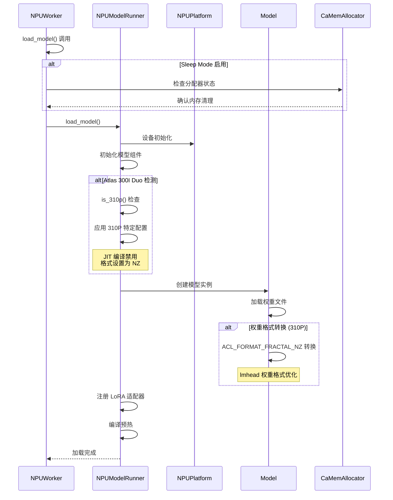

# 模型加载详细流程

## 概述

本文档详细分析 vLLM Ascend 在 Atlas 300I Duo 平台上的模型加载流程，包括权重初始化、格式转换和平台特定优化。

## 模型加载流程图



## 详细流程分析

### 1. Worker 层面的模型加载

#### 1.1 加载入口点
**文件**: `worker/worker_v1.py:212-225`

```python
def load_model(self) -> None:
    if self.vllm_config.model_config.enable_sleep_mode:
        allocator = CaMemAllocator.get_instance()
        assert allocator.get_current_usage() == 0, (
            "Memory allocator should be empty before loading model.")
        # Sleep mode 的内存管理初始化
        context = allocator.forward_use_cann_mem()
    else:
        from contextlib import nullcontext
        context = nullcontext()  # type: ignore

    with context:
        self.model_runner.load_model()
```

**关键特性**:
- **Sleep Mode 支持**: 特殊的内存分配器管理
- **内存状态检查**: 确保加载前内存状态干净
- **上下文管理**: 使用上下文管理器确保资源正确释放

#### 1.2 Sleep Mode 内存管理
**文件**: `device_allocator/camem.py`

CaMem 分配器提供：
- 内存使用量跟踪
- 内存休眠与恢复
- CANN 内存池管理

### 2. ModelRunner 层面的模型加载

#### 2.1 ModelRunner 初始化
**文件**: `worker/model_runner_v1.py:224-249`

```python
def __init__(self, vllm_config: VllmConfig, device: torch.device):
    self.vllm_config = vllm_config
    self.model_config = vllm_config.model_config
    self.cache_config = vllm_config.cache_config
    self.compilation_config = vllm_config.compilation_config
    self.load_config = vllm_config.load_config
    self.lora_config = vllm_config.lora_config
    self.parallel_config = vllm_config.parallel_config

    # 设备和内存配置
    self.device = device
    self.pin_memory = is_pin_memory_available()
```

#### 2.2 Atlas 300I Duo 特定配置
**文件**: `worker/model_runner_v1.py`

```python
# 全局配置设置
torch.npu.config.allow_internal_format = True

if is_310p():
    torch_npu.npu.set_compile_mode(jit_compile=False)  # 禁用 JIT 编译
    ACL_FORMAT = ACL_FORMAT_FRACTAL_NZ                 # 使用 NZ 格式
else:
    ACL_FORMAT = ACL_FORMAT_FRACTAL_ND                 # 使用 ND 格式
```

**配置说明**:
- **内部格式允许**: 启用 NPU 内部优化格式
- **JIT 编译禁用**: Atlas 300I Duo 上禁用动态编译
- **内存格式选择**: NZ 格式在 310P 上性能更优

### 3. 模型实例创建

#### 3.1 模型构建器选择
**流程**: vLLM 核心根据模型配置选择对应的模型构建器

**支持的模型类型**:
- Transformer 类模型 (如 Qwen, LLaMA)
- MoE 模型 (如 DeepSeek)
- 多模态模型 (如 Qwen-VL)

#### 3.2 模型组件初始化
**主要组件**:
- **Embedding 层**: 词嵌入和位置嵌入
- **Transformer 层**: 注意力和 MLP 层
- **输出层**: LM Head 层

### 4. 权重加载与格式转换

#### 4.1 权重文件读取
**流程**: 从 HuggingFace 格式或本地文件加载权重

支持的格式：
- `.safetensors` (推荐)
- `.bin` (PyTorch 原生)
- `.pth` 文件

#### 4.2 Atlas 300I Duo 权重格式优化
**文件**: `torchair/models/torchair_pangu_moe.py`

```python
def load_weights(self, weights: Iterable[Tuple[str, torch.Tensor]]):
    loaded_params = set()
    for name, loaded_weight in weights:
        # 标准权重加载逻辑
        for param_name, weight_loader in param_dict.items():
            if param_name in name:
                param = params_dict[param_name]
                weight_loader(param, loaded_weight)
                loaded_params.add(name)

                # Atlas 300I Duo 特定优化
                if is_310p() and "head" in name:
                    # 在 300I Duo 平台上，ACL_FORMAT_FRACTAL_NZ 比
                    # ACL_FORMAT_FRACTAL_ND 在 matmul 操作中性能更优
                    param.data = torch_npu.npu_format_cast(
                        param.data, ACL_FORMAT_FRACTAL_NZ)
                break
```

**优化要点**:
- **格式转换**: LM Head 权重转换为 NZ 格式
- **性能考虑**: NZ 格式在矩阵乘法中性能更优
- **选择性转换**: 只对特定层进行格式转换

#### 4.3 量化权重处理
**文件**: `quantization/w8a8.py`

```python
if is_310p():
    # 在 300I Duo 平台上，使用 nz 格式时需要额外的转置
    # 该转置在 torchair 中可以跳过
    output = torch_npu.npu_quant_matmul(x, weight, ...)
```

### 5. LoRA 适配器管理

#### 5.1 LoRA 注册
**Mixin**: `LoRAModelRunnerMixin`

```python
def set_active_loras(self, lora_requests, lora_mapping):
    # LoRA 适配器激活和映射
    self.active_loras = lora_requests
    self.lora_mapping = lora_mapping
```

#### 5.2 动态 LoRA 切换
支持运行时动态切换 LoRA 适配器，无需重新加载模型。

### 6. 编译与预热

#### 6.1 ACL Graph 编译
**条件**: 当 `use_aclgraph` 为 True 时

```python
self.use_aclgraph = self._use_aclgraph()
if self.use_aclgraph:
    self.aclgraph_batch_sizes = list(
        reversed(self.compilation_config.cudagraph_capture_sizes))
```

#### 6.2 模型预热
**目的**:
- 触发 ACL Graph 编译
- 预分配内存池
- 优化执行路径

### 7. Atlas 300I Duo 特定配置应用

#### 7.1 Attention 配置
**文件**: `attention/attention_v1.py`

```python
def get_kv_cache_shape(num_blocks, block_size, num_kv_heads, head_size):
    if is_310p():
        # 310P 使用 5 维布局优化内存访问
        return (2, num_blocks, num_kv_heads * head_size // 16, block_size, 16)
    else:
        # 其他平台使用 4 维布局
        return (2, num_blocks, block_size, num_kv_heads * head_size)
```

#### 7.2 MoE 配置优化
**文件**: `torchair/models/torchair_pangu_moe.py`

```python
# 在 300I Duo 平台上，将 num_voted_experts 设置为 5 可以在
# 不太损失精度的情况下获得良好性能
num_voted_experts = 5 if is_310p() else 8
```

#### 7.3 线性层优化
**文件**: `worker/model_runner_v1.py`

```python
if is_310p():
    from vllm.model_executor.layers.linear import (
        MergedColumnParallelLinear, QKVParallelLinear,
        RowParallelLinear, ColumnParallelLinear)

    # 310P 平台线性层权重格式转换
    for name, module in self.model.named_modules():
        if isinstance(module, (MergedColumnParallelLinear, QKVParallelLinear,
                             RowParallelLinear, ColumnParallelLinear)):
            weight = module.weight.data
            weight = torch_npu.npu_format_cast(weight, ACL_FORMAT)
            module.weight.data = weight
```

### 8. 错误处理与验证

#### 8.1 权重完整性检查
```python
def verify_loading():
    missing_keys = []
    unexpected_keys = []

    for name, param in self.model.named_parameters():
        if name not in loaded_params:
            missing_keys.append(name)

    if missing_keys or unexpected_keys:
        logger.warning(f"Missing keys: {missing_keys}")
        logger.warning(f"Unexpected keys: {unexpected_keys}")
```

#### 8.2 格式转换验证
```python
def verify_format_conversion():
    for name, param in self.model.named_parameters():
        if is_310p() and "head" in name:
            format_info = torch_npu.get_npu_format(param)
            assert format_info == ACL_FORMAT_FRACTAL_NZ
```

### 9. 性能优化建议

#### 9.1 加载优化
1. **权重预处理**: 离线转换权重格式
2. **并行加载**: 多线程加载不同层的权重
3. **内存映射**: 使用 mmap 减少内存拷贝

#### 9.2 格式转换优化
1. **选择性转换**: 只转换关键层的权重
2. **批量转换**: 批量处理权重格式转换
3. **缓存结果**: 缓存转换后的权重

#### 9.3 Atlas 300I Duo 优化
1. **预编译**: 提前生成 ACL Graph
2. **内存对齐**: 确保权重 16 字节对齐
3. **格式一致性**: 统一使用 NZ 格式

## 总结

Atlas 300I Duo 的模型加载流程在标准 vLLM 流程基础上增加了：

1. **平台检测**: 运行时识别 310P 平台
2. **格式优化**: NZ 格式权重转换
3. **配置适配**: JIT 禁用和专用配置
4. **内存优化**: 5 维 KV Cache 布局
5. **性能调优**: MoE 专家数量优化

这些优化确保了在 Atlas 300I Duo 平台上的最佳性能表现。

---

*相关文档*:
- [平台检测流程](platform_detection_flow.md)
- [内存管理流程](memory_management_flow.md)
- [Attention 计算流程](attention_computation_flow.md)