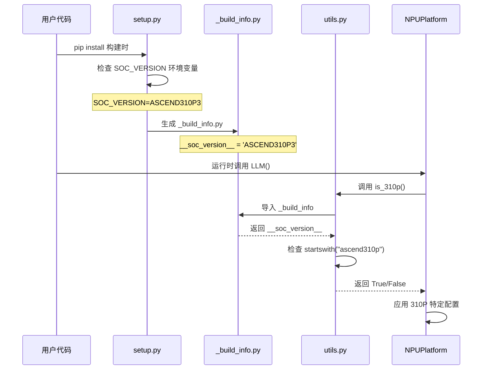

# 平台检测与初始化流程

## 概述

本文档详细描述 vLLM Ascend 中 Atlas 300I Duo 平台的检测与初始化流程，涵盖从环境变量到运行时检测的完整链路。

## 检测流程图



## 详细实现分析

### 1. 构建时检测

#### 1.1 环境变量检查
**文件**: `setup.py:85-93`

```python
class custom_build_info(build_py):
    def run(self):
        soc_version = envs.SOC_VERSION
        if not soc_version:
            raise ValueError(
                "SOC version is not set. Please set SOC_VERSION environment variable."
            )
        if "310" in soc_version and not envs.COMPILE_CUSTOM_KERNELS:
            raise ValueError(
                "SOC version 310 only supports custom kernels. Please set COMPILE_CUSTOM_KERNELS=1 to enable custom kernels."
            )
```

**关键点**:
- 必须设置 `SOC_VERSION` 环境变量
- Atlas 300I Duo 必须启用自定义内核: `COMPILE_CUSTOM_KERNELS=1`
- 环境变量格式: `ASCEND310P3`

#### 1.2 构建信息生成
**位置**: `setup.py:95-103`

```python
package_dir = os.path.join(ROOT_DIR, "vllm_ascend", "_build_info.py")
with open(package_dir, "w+") as f:
    f.write('# Auto-generated file\n')
    f.write(f"__soc_version__ = '{soc_version}'\n")
    f.write(f"__sleep_mode_enabled__ = {envs.COMPILE_CUSTOM_KERNELS}\n")
```

**生成的文件内容**:
```python
# _build_info.py (自动生成)
__soc_version__ = 'ASCEND310P3'
__sleep_mode_enabled__ = True
```

### 2. 运行时检测

#### 2.1 SOC 版本检测函数
**文件**: `vllm_ascend/utils.py:65-70`

```python
_IS_310P = None  # 全局缓存变量

def is_310p():
    global _IS_310P
    if _IS_310P is None:
        from vllm_ascend import _build_info  # type: ignore
        _IS_310P = _build_info.__soc_version__.lower().startswith("ascend310p")
    return _IS_310P
```

**特点**:
- **延迟加载**: 首次调用时才导入构建信息
- **全局缓存**: 避免重复检测开销
- **字符串匹配**: 使用 `startswith("ascend310p")` 匹配
- **大小写不敏感**: 转换为小写后匹配

#### 2.2 SOC 版本枚举
**文件**: `vllm_ascend/utils.py`

```python
SOC_VERSION_INFERENCE_SERIES = ["Ascend310P3"]

class AscendSocVersion(Enum):
    A2 = 0
    A3 = 1
    UNDEFINED = 2
```

**注意**: 310P 系列单独处理，不在枚举中

### 3. 平台初始化

#### 3.1 插件注册
**文件**: `vllm_ascend/__init__.py:19-22`

```python
def register():
    """Register the NPU platform."""
    return "vllm_ascend.platform.NPUPlatform"
```

#### 3.2 平台配置
**文件**: `vllm_ascend/platform.py:46-55`

```python
class NPUPlatform(Platform):
    _enum = PlatformEnum.OOT
    device_name: str = "npu"
    device_type: str = "npu"
    simple_compile_backend: str = "eager"  # 禁用 torch.compile()
    ray_device_key: str = "NPU"
    device_control_env_var: str = "ASCEND_RT_VISIBLE_DEVICES"
    dispatch_key: str = "PrivateUse1"
```

#### 3.3 预注册处理
**文件**: `vllm_ascend/platform.py:62-67`

```python
@classmethod
def pre_register_and_update(cls, parser=None):
    # 应用全局补丁
    from vllm_ascend.utils import adapt_patch
    adapt_patch(is_global_patch=True)
```

### 4. Atlas 300I Duo 特定配置

#### 4.1 编译配置
**触发位置**: 多个模块中的 `if is_310p():` 条件

**主要配置项**:

1. **JIT 编译禁用**:
   ```python
   # model_runner_v1.py
   if is_310p():
       torch_npu.npu.set_compile_mode(jit_compile=False)
   ```

2. **内存格式选择**:
   ```python
   # model_runner_v1.py
   if is_310p():
       ACL_FORMAT = ACL_FORMAT_FRACTAL_NZ
   else:
       ACL_FORMAT = ACL_FORMAT_FRACTAL_ND
   ```

3. **TorchAir 配置**:
   ```python
   # torchair_model_runner.py
   config.experimental_config.tiling_schedule_optimize = not is_310p()
   ```

#### 4.2 Worker 初始化适配
**文件**: `worker/worker_v1.py:88-94`

```python
register_ascend_customop(vllm_config)
init_ascend_config(vllm_config)
init_ascend_soc_version()  # 昇腾 SOC 版本初始化
```

### 5. 检测流程验证

#### 5.1 构建时验证
**命令行检查**:
```bash
export SOC_VERSION=ASCEND310P3
export COMPILE_CUSTOM_KERNELS=1
pip install -v -e .
```

**验证构建信息**:
```python
from vllm_ascend import _build_info
print(_build_info.__soc_version__)      # 应输出: ASCEND310P3
print(_build_info.__sleep_mode_enabled__)  # 应输出: True
```

#### 5.2 运行时验证
**代码验证**:
```python
from vllm_ascend.utils import is_310p
print(f"Is Atlas 300I Duo: {is_310p()}")  # 应输出: True
```

### 6. 错误处理

#### 6.1 常见错误场景

1. **未设置 SOC_VERSION**:
   ```
   ValueError: SOC version is not set. Please set SOC_VERSION environment variable.
   ```

2. **310P 未启用自定义内核**:
   ```
   ValueError: SOC version 310 only supports custom kernels. Please set COMPILE_CUSTOM_KERNELS=1 to enable custom kernels.
   ```

3. **构建信息缺失**:
   ```
   ImportError: No module named '_build_info'
   ```

#### 6.2 故障排除步骤

1. **检查环境变量**:
   ```bash
   echo $SOC_VERSION           # 应显示 ASCEND310P3
   echo $COMPILE_CUSTOM_KERNELS  # 应显示 1
   ```

2. **验证构建文件**:
   ```bash
   ls vllm_ascend/_build_info.py  # 文件应存在
   cat vllm_ascend/_build_info.py  # 检查内容
   ```

3. **重新构建**:
   ```bash
   pip uninstall vllm_ascend
   rm -rf build/ *.egg-info/
   pip install -v -e .
   ```

### 7. 性能考虑

#### 7.1 检测开销
- **构建时**: 一次性开销，生成静态文件
- **运行时**: 首次调用有导入开销，后续调用为 O(1)
- **内存占用**: 全局变量缓存，开销极小

#### 7.2 优化建议
- 避免在热路径中重复调用检测函数
- 利用全局缓存机制减少重复检测
- 在模块初始化时完成平台检测

## 总结

Atlas 300I Duo 的平台检测采用了两阶段机制：
1. **构建时**: 通过环境变量生成静态配置文件
2. **运行时**: 通过字符串匹配进行快速检测

这种设计既保证了检测的准确性，又最小化了运行时开销，为后续的平台特定优化提供了可靠的基础。

---

*相关文档*:
- [模型加载流程](model_loading_flow.md)
- [内存管理流程](memory_management_flow.md)
- [推理执行流程](inference_execution_flow.md)